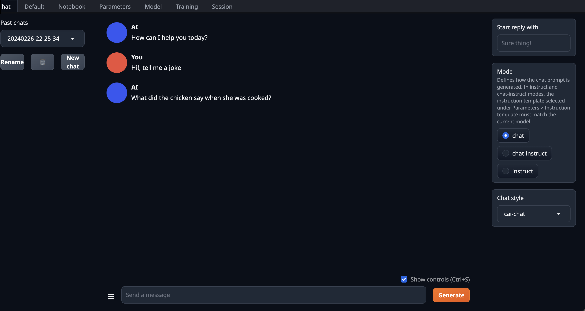
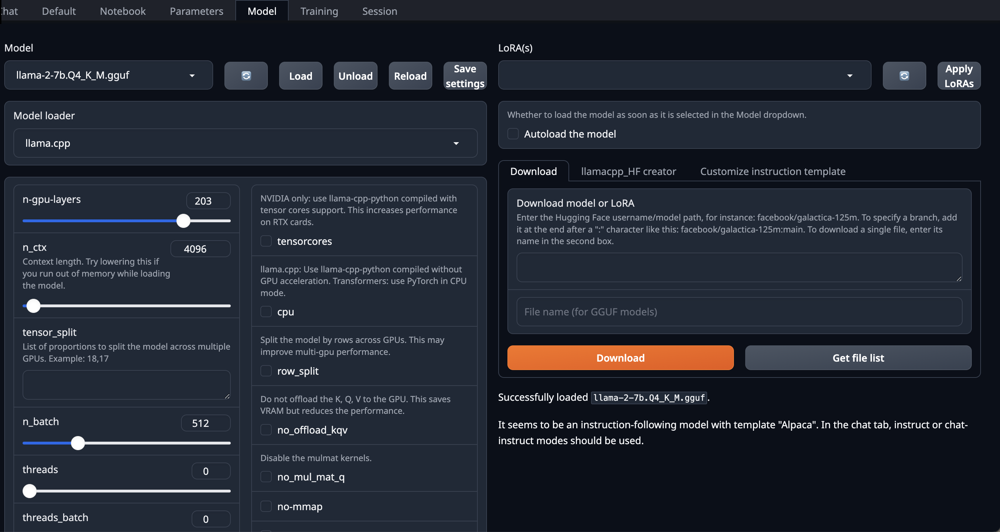

# Optimizing Generative AI LLM Inference Deployment on AWS GPUs By Leveraging Quantization with llama.cpp 

This repository provides a *Cloudformation template* to create, evaluate and run quantized Large Language Models (LLMs) with Llama.cpp on Amazon EC2. For more detailed information on Benchmarking refer to the [Quantization Benchmarks](Quantization Benchmarks.md) file.

## Contents
- [Results](#results)
    - [Evaluation Harness](#evaluation-harness)
    - [LLM Serving System Benchmark (Inference Performance Evaluation)](#llm-serving-system-benchmark-inference-performance-evaluation)
- [Deployment](#deployment)
    - [Instance type quota increase](#instance-type-quota-increase)
- [Serving an LLM with Llama.cpp](#serving-an-llm-with-llamacpp)
- [Evaluation Harness](#evaluation-harness)
- [Performance Benchmarking with Llama.cpp](#performance-benchmarking-with-llamacpp)
    - [Batched-bench](#batched-bench)
    - [Llama-bench](#llama-bench)

## Results
### Evaluation Harness 

| Model name | Quant Method | Bits | Size     | Max RAM required | Task      | Avg Accuracy |   
|------------|--------------|------|----------|------------------|-----------|--------------|
| Llama2-7B  | Q4_K_M       |    4 | 4.08 GB  | 6.58 GB          | MMLU      |       41.25% |   
|            |              |      |          |                  | HellaSwag |       56.78% |   
| Llama2-7B  | Q8_0         |    8 | 7.16 GB  | 9.66 GB          | MMLU      |       41.86% |   
|            |              |      |          |                  | HellaSwag |       57.11% |  
| Llama2-7B  | NONE         |   16 | 13.48 GB | 14GB             | MMLU      |       41.83% |   
|            |              |      |          |                  | HellaSwag |       57.12% |   
| Llama2-13B | Q4_K_M       |    4 | 7.87 GB  | 10.37 GB         | MMLU      |       51.70% |  
|            |              |      |          |                  | HellaSwag |       59.98% |  


### LLM Serving System Benchmark (Inference Performance Evaluation)

Scenario:
Prompt size - 512
KV cache size - 4096
Tokens Generated- 512
1 batch sample size


|  Models         |  Token Generation Speed tok/s |  Total time for inference in Seconds |  Total Speed in tok/s |  Maximum clients in parallel |
|-----------------|-------------------------------|--------------------------------------|-----------------------|------------------------------|
|  Llama2 7B FP16 |  17.77 tok/s                  |  29.205 s                            |  35.06 tok/s          | 2                            |
|  Llama2 7B INT4 |  38.65 tok/s                  |  13.759 s                            |  68.67 tok/s          | 4                            |
|  Llama2 7B INT8 |  29.72 tok/s                  |  17.782 s                            |  57.59 tok/s          | 4                            |
|  Llama2 13 INT4 |  21.57 tok/s                  |  24.624 s                            |  41.59 tok/s          | 4                            |


Scenario:
Prompt size - 1024
KV cache size - 8192
Tokens Generated- 1024
1 batch sample size


|  Models         |  Token Generation Speed tok/s |  Total time for Inference in Seconds |  Total speed in tok/s |  Maximum clients in parallel |
|-----------------|-------------------------------|--------------------------------------|-----------------------|------------------------------|
|  Llama2 7B FP16 |  Did not have enough memory   |  -                                   |  -                    |  -                           |
|  Llama2 7B INT4 |  35.60 tok/s                  |  29.822 s                            |  68.67 tok/s          | 4                            |
|  Llama2 7B INT8 |  27.82 tok/s                  |  37.943 s                            |  53.98 tok/s          | 4                            |
|  Llama2 13 INT4 |  Did not have enough memory   |  -                                   |  -                    |  -                           |

## Deployment

The solution is deployed using an AWS CloudFormation template with Amazon EC2. To deploy the solution, use one of the following CloudFormation templates and follow the instructions below.

| AWS Region | AWS CloudFormation Template URL |
|:-----------|:----------------------------|
| us-east-1 (N. Virginia) |<a href="https://console.aws.amazon.com/cloudformation/home?region=us-east-1#/stacks/new?stackName=llamacpp&templateURL=" target="_blank">Launch stack</a> |
| us-east-2 (Ohio) |<a href="https://console.aws.amazon.com/cloudformation/home?region=us-east-2#/stacks/new?stackName=llamacpp&templateURL=" target="_blank">Launch stack</a> |
| us-west-1 (N. California) |<a href="https://console.aws.amazon.com/cloudformation/home?region=us-west-1#/stacks/new?stackName=llamacpp&templateURL=" target="_blank">Launch stack</a> |
| us-west-2 (Oregon) |<a href="https://console.aws.amazon.com/cloudformation/home?region=us-west-2#/stacks/new?stackName=llamacpp&templateURL=" target="_blank">Launch stack</a> |
| ap-northeast-1 (Tokyo) |<a href="https://console.aws.amazon.com/cloudformation/home?region=ap-northeast-1#/stacks/new?stackName=llamacpp&templateURL=" target="_blank">Launch stack</a> |
| ap-northeast-2 (Seoul) |<a href="https://console.aws.amazon.com/cloudformation/home?region=ap-northeast-2#/stacks/new?stackName=llamacpp&templateURL=" target="_blank">Launch stack</a> |
| ap-northeast-3 (Osaka) |<a href="https://console.aws.amazon.com/cloudformation/home?region=ap-northeast-3#/stacks/new?stackName=llamacpp&templateURL=" target="_blank">Launch stack</a> |
| ap-south-1 (Mumbai) |<a href="https://console.aws.amazon.com/cloudformation/home?region=ap-south-1#/stacks/new?stackName=llamacpp&templateURL=" target="_blank">Launch stack</a> |
| ap-southeast-1 (Singapore) |<a href="https://console.aws.amazon.com/cloudformation/home?region=ap-southeast-1#/stacks/new?stackName=llamacpp&templateURL=" target="_blank">Launch stack</a> |
| ap-southeast-2 (Sydney) |<a href="https://console.aws.amazon.com/cloudformation/home?region=ap-southeast-2#/stacks/new?stackName=llamacpp&templateURL=" target="_blank">Launch stack</a> |
| ca-central-1 (Central) |<a href="https://console.aws.amazon.com/cloudformation/home?region=ca-central-1#/stacks/new?stackName=llamacpp&templateURL=" target="_blank">Launch stack</a> |
| eu-central-1 (Frankfurt) |<a href="https://console.aws.amazon.com/cloudformation/home?region=eu-central-1#/stacks/new?stackName=llamacpp&templateURL=" target="_blank">Launch stack</a> |
| eu-west-1 (Dublin) |<a href="https://console.aws.amazon.com/cloudformation/home?region=eu-west-1#/stacks/new?stackName=llamacpp&templateURL=" target="_blank">Launch stack</a> |
| eu-west-2 (London) |<a href="https://console.aws.amazon.com/cloudformation/home?region=eu-west-2#/stacks/new?stackName=llamacpp&templateURL=" target="_blank">Launch stack</a> |
| eu-west-3 (Paris) |<a href="https://console.aws.amazon.com/cloudformation/home?region=eu-west-3#/stacks/new?stackName=llamacpp&templateURL=" target="_blank">Launch stack</a> |


This CloudFormation template launches an EC2 instance that includes all dependencies for serving and evaluating Large Language Models (LLMs) from HuggingFace using Llama.cpp, Evaluation Harness, and Text Generation Web UI.

1. Click on one of the links above to deploy the solution via CloudFormation in your AWS account. 

2. Click the Upload a template file bottom and then upload the [deployment.yaml](cloudformation/deployment.yml). Click the orange Next button located in the bottom right corner of the console to configure the deployment.

3. Set a stack name, select your desired EC2 instance type, and set a user name and password for connecting to the web ui.

4. Once you have decided on a stack name, and configured the parameters click Next to continue.

5. On the next step, Configure stack options, leave all values as they are and click Next to continue.

6. On the Review step

    a. Check the three boxes under Capabilities and transforms to acknowledge the template will create IAM resources and leverage transforms.

    b. Click the Create stack button located at the bottom of the page to deploy the template.

    The stack should take around 15-20 minutes to deploy.

7. Open the generated **Text Generation Web UI** Url from outputs above i.e. `http:xxx.xxx.xxx.xxx`. **Note:** The app uses *http* requests to communicate with the backend server rather than *https* requests.

8. Login with the user and password created in step 3.

| |  |
|:---:|:---:|

### Instance type quota increase

Complete the following steps:

- Open the [Service Quotas console](https://console.aws.amazon.com/servicequotas/).
- Choose Amazon EC2.
- Choose the service quota.
- Choose Request quota increase.

**Note:** To make sure that you have enough quotas to support your usage requirements, it's a best practice to monitor and manage your service quotas. Requests for Amazon EC2 service quota increases are subject to review by AWS engineering teams. Also, service quota increase requests aren't immediately processed when you submit a request. After your request is processed, you receive an email notification.

## Serving an LLM with Llama.cpp

Open a terminal on your EC2 instance and run the following commands:

1. Move to working directory

```sh
sudo su -
cd /home/ubuntu
```

2. Activate Llama-cpp-python virtual environment

```sh
conda activate llamacpp
```

3. Download Llama-2-7B model from HuggingFace

We use the converted and quantized model by [TheBloke](https://huggingface.co/TheBloke).

```sh
huggingface-cli download TheBloke/Llama-2-7B-GGUF llama-2-7b.Q4_K_M.gguf --local-dir . --local-dir-use-symlinks False
```
4. Optionally, you can also convert to FP16 GGUF and quantize your own model with Llama.cpp as well

```sh
# convert to F16 GGUF
python3 convert.py ./models/model-name --outfile ./models/model name/ggml-model-f16.gguf --outtype f16

# quantize to Q8_0 and Q4_K
./quantize ./models/model-name/ggml-model-f16.gguf ./models/model-name/ggml-model-q8_0.gguf q8_0
./quantize ./models/model-name/ggml-model-f16.gguf ./models/model-name/ggml-model-q4_k.gguf q4_k
```
5. Serving Llama-2-7B with LlamaCpp

```sh
python3 -m llama_cpp.server --model llama-2-7b.Q4_K_M.gguf \
    --n_ctx 2048 \
    --n_gpu_layers -1
```

## Evaluation Harness

Open a terminal on your EC2 instance and run the following commands:

1. Move to working directory

```sh
sudo su -
cd /home/ubuntu
```

2. Activate Evaluation Harness virtual environment

```sh
conda activate harness
```

3. Run llm evaluation with LM Evaluation Harness

```sh
cd /home/ubuntu/lm-evaluation-harness
lm_eval \
    --model gguf \
    --model_args base_url=http://localhost:8000 \
    --tasks mmlu,hellaswag \
    --log_samples \
    --output_path output/llama-2-7b-Q4_K_M
```

4. Visualize eval harness results with Zeno.

First, create an account and get an API key on your [zeno account page](https://hub.zenoml.com/account).

After that, add this key as an environment variable:

```sh
export ZENO_API_KEY=[your api key]
```

Then, upload the resulting data using the `zeno_visualize` script:

```sh
python3 scripts/zeno_visualize.py \
    --data_path eval_results \
    --project_name "Llama2-7b.Q4_K_M"
```

5. Create llm evaluation chart with plotly

First, copy the script [create_chart.py](eval_results/create_chart.py) into the directory *eval_results*. Then, run the following command:

```sh
python3 ./eval_results/create_chart.py --result_path "./eval_results" --tasks hellaswag,mmlu --output_path "./images"
```

## Performance Benchmarking with Llama.cpp

Open a terminal on your EC2 instance and run the following commands:

1. Move to working directory

```sh
sudo su -
cd /home/ubuntu/llama.cpp
```

2. Activate Llama.cpp virtual environment

```sh
source llamacpp-venv/bin/activate
```

3. Locate and modify `Makefile` 

```sh
export MakeFileLineNumber=$(grep -n -F -w "MK_NVCCFLAGS += -arch=native" Makefile | cut -d : -f 1)
echo $MakeFileLineNumber
vim +${MakeFileLineNumber} Makefile
```
After running the commands above, the `Makefile` will open. Replace `MK_NVCCFLAGS += -arch=native` with `MK_NVCCFLAGS += -arch=all`.

### Batched-bench

1. Build benchmark

```sh
LLAMA_CUBLAS=1 make -j batched-bench
```

2. Run benchmark

```sh
./batched-bench ../llama-2-7b.Q4_K_M.gguf 4096 0 99 0 512 512 1,2,3,4
```

### Llama-bench

1. Build benchmark

```sh
LLAMA_CUBLAS=1 make -j llama-bench
```

2. Run benchmark

```sh
./llama-bench -m ../llama-2-7b.Q4_K_M.gguf -p 512 -n 128,256,512
```

## Authors
- [Armando Diaz Gonzalez](https://www.linkedin.com/in/armando-diaz-47a498113/)
- [Niithiyn Vijeaswaran](https://www.linkedin.com/in/niithiyn-v-451245213/)
- [Rohit Talluri](https://www.linkedin.com/in/rohittalluri/)
- [Marco Punio](https://www.linkedin.com/in/marcpunio/)

# Credits

This sample was made possible thanks to the following libraries:
- [llama.cpp](https://github.com/ggerganov/llama.cpp) from [Georgi Gerganov](https://github.com/ggerganov)
- [lm-evaluation-harness](https://github.com/EleutherAI/lm-evaluation-harness) from [EleutherAI](https://github.com/EleutherAI)
- [text-generation-webui](https://github.com/oobabooga/text-generation-webui/tree/main) from [Oobabooga](https://github.com/oobabooga)

## Contributing

We welcome community contributions! Please see [CONTRIBUTING.md](CONTRIBUTING.md) for guidelines.

## Security

See [CONTRIBUTING](CONTRIBUTING.md#security-issue-notifications) for more information.

## License

This library is licensed under the MIT-0 License. See the [LICENSE](LICENSE) file.
